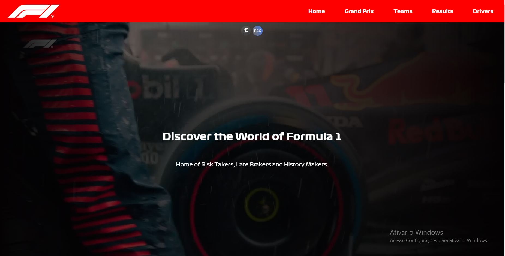
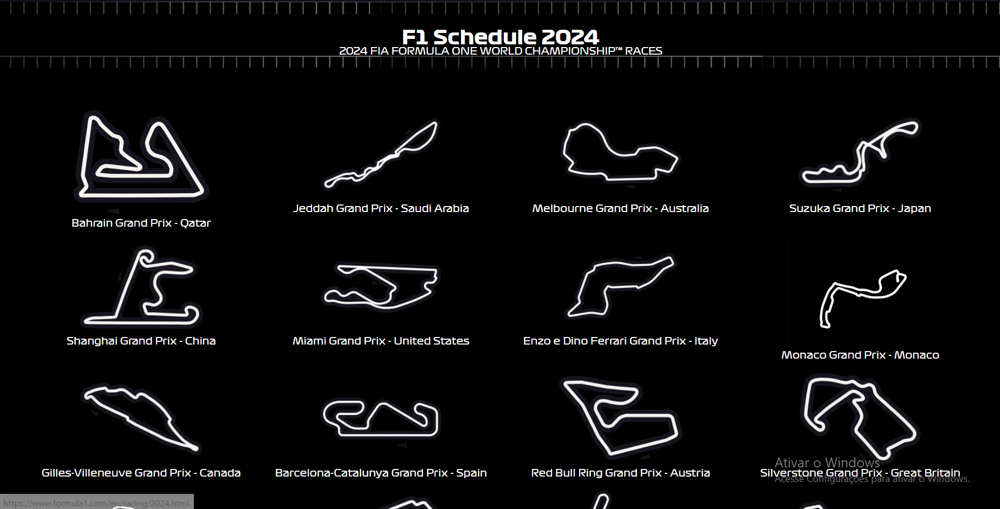
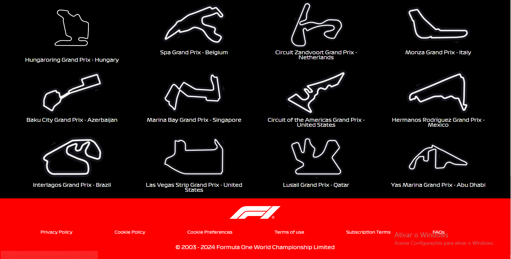

# Landing Page - Formula 1

This project is a simple landing page using HTML and CSS, applying concepts of CSS variables and better structuring of project folders.

### Technologies Used:

- **HTML 5**
- **CSS 3**

### Images of the Site:

- **Page header with navigation bar and opening video in the background.** 

- **Grand Prix section with an image of the track, name and location.** 

- **Continuation of the Grand Prix section and page footer.** 

